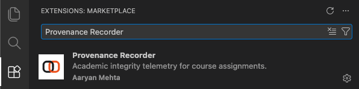
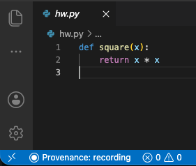
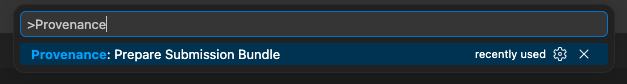

## Recording your work with the Provenance Recorder

For some assignments this term you'll record your work with the **Provenance Recorder**, a VS Code extension that keeps a tamper-evident log of *how* your code comes together as you work. When you're done, the extension bundles your assignment files together with that log into a single sealed `.zip` — that one file is your submission, so your work can be reviewed as a process and not just a final file.

The extension only runs inside assignment folders the course has authorized. In every other folder it does nothing — no recording, no network requests, and no change to how VS Code behaves. Setup takes about two minutes, and you only do it once.

> **What gets recorded?** Inside the assignment folder only: your edits, pastes, saves, terminal commands, and editor focus. Everything stays on your computer until *you* upload the sealed `.zip`. The complete, itemized list is on the [extension's Marketplace page](https://marketplace.visualstudio.com/items?itemName=itsgeagle.provenance-recorder#what-it-records).

### Before you start

You'll need:

- **Visual Studio Code 1.94 or newer.** Check via **Code → About Visual Studio Code** (macOS) or **Help → About** (Windows/Linux). Update from <https://code.visualstudio.com> if you're behind.
- **The assignment folder** distributed for the assignment. It contains a hidden `.provenance-manifest` file — that's what authorizes recording. If it's missing, recording can't start; re-download the starter files.

### 1. Install the extension

The extension is on the Visual Studio Code Marketplace:

**<https://marketplace.visualstudio.com/items?itemName=itsgeagle.provenance-recorder>**

Install it from inside VS Code:

1. Open VS Code.
2. Click the **Extensions** icon in the left sidebar (four squares), or press **`⇧⌘X`** (macOS) / **`Ctrl+Shift+X`** (Windows/Linux).
3. Search for **`Provenance Recorder`**.
4. On the result published by **Aaryan Mehta (itsgeagle)**, click **Install**.

> **One-line install:** Press **`⌘P`** / **`Ctrl+P`**, paste `ext install itsgeagle.provenance-recorder`, and press **Enter**.

You don't need to sign in or create an account. The extension is free and makes no network requests during a session.

### 2. Open the assignment folder

Open the **exact** assignment folder you were given — not a parent folder, and not a subfolder.

- **File → Open Folder…**, then select the assignment folder.

The folder must contain the `.provenance-manifest` file. When VS Code detects it, the recorder activates automatically.

### 3. Confirm it's recording

Look at the **status bar** along the bottom of the VS Code window:

**If you see `Provenance: recording`, you're set.** That indicator is the only visible change — no popups, no toolbars, no slowdown. Write, save, run, and debug exactly as you normally would; IntelliSense, the integrated terminal, your keybindings, and your theme are all untouched.

If you **don't** see it, your work isn't being logged yet — see [Troubleshooting](#troubleshooting) below.

> A hidden `.provenance/` folder appears inside the assignment workspace — that's where the log lives. Don't delete, edit, or commit it. The submission step bundles it for you.

### 4. Work normally

Just do the assignment. The log is appended continuously, so you can:

- Close VS Code and come back later — reopening the folder starts a new session that links to the previous one. Nothing is lost.
- Use the integrated terminal, run and debug code, install other extensions — all fine.

There's nothing to start or stop. As long as the status bar says `Provenance: recording`, you're covered.

### 5. Prepare your submission bundle

When you've finished the assignment:

1. Open the command palette: **`⇧⌘P`** (macOS) / **`Ctrl+Shift+P`** (Windows/Linux).
2. Type **`Prepare Submission Bundle`** and select **Provenance: Prepare Submission Bundle**.

A sealed **`.zip`** file is saved next to your assignment folder. VS Code shows you where. This bundle contains both your assignment files and the process log.

### 6. Submit

Upload **only that `.zip`** to Gradescope — nothing else. The bundle already includes your assignment files, so you don't submit your code separately.

### Troubleshooting

**The status bar doesn't say `Provenance: recording`.**
The recorder only activates for an authorized assignment folder. Check that:
- You opened the assignment folder *itself*, not a parent or subfolder.
- The `.provenance-manifest` file is still present in that folder.
- You installed the build the course expects. If the manifest's signature doesn't match your installed build, recording won't start — reinstall the version posted for this assignment.

**The "Prepare Submission Bundle" command isn't in the palette.**
The command only appears while the extension is active. Confirm the `Provenance: recording` indicator first (above).

**I closed VS Code in the middle of the assignment — did I lose my log?**
No. The log is written continuously, not held until submission. Reopen the folder and keep working; the new session links to the previous one.

**Sealing the submission bundle failed.**
You'll see an error message. The usual cause is a partially-written log file, which the extension repairs automatically on the next launch. Reopen the folder and run **Prepare Submission Bundle** again.

**Can I see exactly what was recorded?**
Yes. The files in the hidden `.provenance/` folder (`session-*.slog`) are plain newline-delimited JSON. Open them in any text editor and read every event as it was logged. Recording is fully transparent — there are no hidden signals.

### Privacy at a glance

- The log lives **only on your computer** until you upload the sealed `.zip` yourself.
- The extension makes **no network requests** and sends nothing anywhere automatically.
- It records **nothing outside the assignment folder** — other projects, your browser, your clipboard in general, and other apps are invisible to it.
- It does **not** record your name, email address, or IP address.

For the complete, itemized list of what is and isn't captured, see the [extension's Marketplace page](https://marketplace.visualstudio.com/items?itemName=itsgeagle.provenance-recorder#what-it-records).
