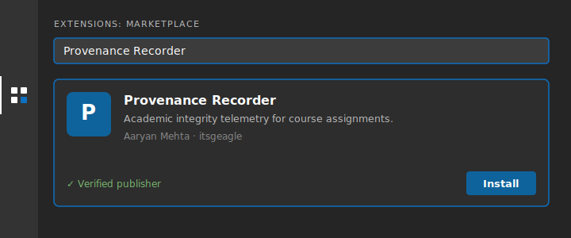
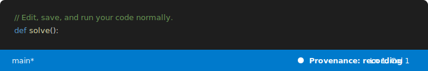
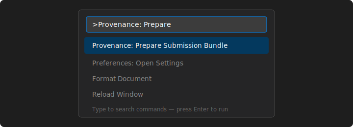

# Provenance Recorder — Student Guide

This guide walks you through installing the **Provenance Recorder** VS Code extension and using it for a course assignment. It takes about two minutes to set up.

The extension keeps a tamper-evident log of *how* your code came together while you work, so your assignment can be reviewed as a process rather than just a final file. It only runs inside assignment folders your instructor has authorized — in every other folder it does nothing, makes no network requests, and changes nothing about how VS Code works.

> **What's recorded?** The full list is in the extension's [README](../packages/recorder/README.md#what-it-records). The short version: your edits, pastes, saves, terminal commands, and editor focus inside the assignment folder — stored only on your computer until *you* upload the sealed `.zip`.

---

## Before you start

You need:

- **Visual Studio Code 1.94 or newer.** Check with **Code → About Visual Studio Code** (macOS) or **Help → About** (Windows/Linux). Download the latest from <https://code.visualstudio.com> if needed.
- **The assignment folder** your instructor gave you. It contains a hidden `.provenance-manifest` file — that's what authorizes recording. If you don't have one, recording can't start; ask your instructor.

---

## Step 1 — Install the extension

The extension is on the Visual Studio Code Marketplace:

**<https://marketplace.visualstudio.com/items?itemName=itsgeagle.provenance-recorder>**

Install it from inside VS Code:

1. Open VS Code.
2. Click the **Extensions** icon in the left sidebar (four squares), or press **`⇧⌘X`** (macOS) / **`Ctrl+Shift+X`** (Windows/Linux).
3. In the search box, type **`Provenance Recorder`**.
4. On the result published by **Aaryan Mehta (itsgeagle)**, click **Install**.

> **Tip — one-line install:** Press **`⌘P`** / **`Ctrl+P`** to open Quick Open, paste `ext install itsgeagle.provenance-recorder`, and press **Enter**.

> **Were you given a `.vsix` file instead?** Open the command palette (**`⇧⌘P`** / **`Ctrl+Shift+P`**), run **Extensions: Install from VSIX…**, and pick the file. Use this only if your instructor specifically handed you a `.vsix`.

You don't need to sign in or create an account. The extension is free and makes no network requests during a session.

---

## Step 2 — Open the assignment folder

Open the **exact** assignment folder you were given — not a parent folder, and not a subfolder.

- **File → Open Folder…**, then select the assignment folder.

The folder must contain the `.provenance-manifest` file. When VS Code detects it, the recorder activates automatically.

---

## Step 3 — Confirm it's recording

Look at the **status bar** along the bottom of the VS Code window. You should see:

**If you see `Provenance: recording`, you're set.** That indicator is the only visible change — there are no popups, no toolbars, and no slowdown. Write, save, run, and debug your code exactly as you normally would. IntelliSense, the integrated terminal, your keybindings, and your theme are all untouched.

If you **don't** see it, your work isn't being logged yet — jump to [Troubleshooting](#troubleshooting).

> A hidden `.provenance/` folder appears inside the assignment workspace — that's where the log lives. Don't delete, edit, or commit it. The submission step bundles it for you.

---

## Step 4 — Work normally

Just do the assignment. The log is appended continuously as you go, so you can:

- Close VS Code and come back later — reopening the folder starts a new session that links to the previous one. Nothing is lost.
- Use the integrated terminal, run and debug code, install other extensions — all fine.

There is nothing to start or stop. As long as the status bar says `Provenance: recording`, you're covered.

---

## Step 5 — Prepare your submission bundle

When you've finished the assignment:

1. Open the command palette: **`⇧⌘P`** (macOS) / **`Ctrl+Shift+P`** (Windows/Linux).
2. Type **`Prepare Submission Bundle`** and select **Provenance: Prepare Submission Bundle**.

3. A sealed **`.zip`** file is saved next to your assignment folder. VS Code shows you where.

---

## Step 6 — Submit

Upload that `.zip` **along with your code**, following your assignment's normal submission instructions. The `.zip` is the proof-of-process log; your code is still submitted the usual way.

That's it. You're done.

---

## Troubleshooting

**The status bar doesn't say `Provenance: recording`.**
The recorder only activates for an authorized assignment folder. Check that:
- You opened the assignment folder *itself*, not a parent or subfolder.
- The `.provenance-manifest` file is still present in that folder.
- You installed the build your instructor expects. If the manifest's signature doesn't match your installed build, recording won't start — reinstall the version you were told to use for this assignment.

**The "Prepare Submission Bundle" command isn't in the palette.**
The command only appears while the extension is active. Confirm the `Provenance: recording` indicator first (above).

**I closed VS Code in the middle of the assignment — did I lose my log?**
No. The log is written continuously, not held until submission. Reopen the folder and keep working; the new session links to the previous one.

**Sealing the submission bundle failed.**
You'll see an error message. The usual cause is a partially-written log file, which the extension tries to repair automatically on the next launch. Reopen the folder and run **Prepare Submission Bundle** again.

**Can I see exactly what was recorded?**
Yes. The files in the hidden `.provenance/` folder (`session-*.slog`) are plain newline-delimited JSON. Open them in any text editor and read every event as it was logged. Recording is fully transparent — there are no hidden signals.

---

## Privacy at a glance

- The log lives **only on your computer** until you upload the sealed `.zip` yourself.
- The extension makes **no network requests** and sends nothing anywhere automatically.
- It records **nothing outside the assignment folder** — other projects, your browser, your clipboard in general, and other apps are invisible to it.
- It does **not** record your name, email address, or IP address.

For the complete, itemized list of what is and isn't captured, see the extension [README](../packages/recorder/README.md#what-it-records).
